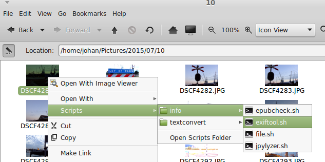
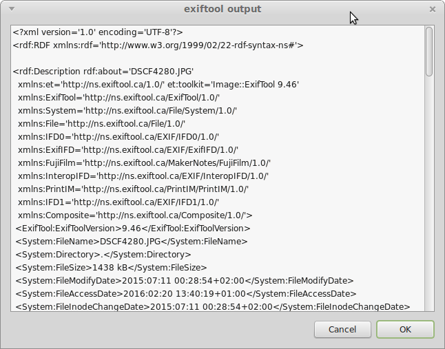

## Right-click context actions for Caja and Nautilus

This repo contains a collection of utility scripts that define context menu actions. These allow you to run a number of command-line tools by right-clicking on a file. Output is displayed in a pop-up text box. I originally got the idea for this from [BitCurator](http://wiki.bitcurator.net/index.php?title=Using_Nautilus_for_Data_Triage), which uses Nautilus scripts for various data triage operations. Most of the scripts in this repo are based on the BitCurator scripts (but extended for additional tools). This collection of scripts will probably expand over time.

## Target environments

The scripts can be used in both the [Unity](https://unity.ubuntu.com/) and [MATE](http://mate-desktop.com/) desktop environments. On Unity (default Ubuntu desktop) you can use them in the Nautilus file manager, whereas on MATE they will work with Caja. 

## Script categories

Scripts are organised into the following categories:

* **identify**: format identification / magic detection using Unix File and Apache Tika.

* **info**: display technical information about a file. Currently included:
    * ExifTool - display metadata on lots of (mostly graphics) formats
    * jhove - display metadata and validity for a number of formats
    * MediaInfo - display metadata on lots of video and audio formats
    * Jpylyzer - validate JPEG 2000 Part 1 + display metadata
    * Epubcheck - validate Epub + display metadata
    * pngcheck - check integrity of PNG, JNG and MNG files
    * tiffinfo - display information  about TIFF file (includes some error checking as well)
    * jpeginfo - check integrity of JPEG file and display some information 
    * gdalinfo - display metadata on varous geospatial formats

* **PDF**: various PDF analysis operations:
    * pdfinfo - display metadata
    * pdftk - display general metadata, annotations
    * qpdf - check on file structure + encryption, linearization

* **imageanalysis**: various basic image analysis scripts, all using ImageMagick
    * psnr - compare 2 images and report difference as PSNR value

* **textconvert**: several conversions from / to Markdown, all using Pandoc.

## Installation

First install [Yad](https://sourceforge.net/projects/yad-dialog/) (if you don't have it already):

    sudo apt-get install yad

**Nautilus** users may also need to install *nautilus-actions* (I don't use Nautilus myself so I don't know if this is necessary):

    sudo apt-get install nautilus-actions
 
If you're using the **Caja** file manager (MATE desktop), copy the scripts in this repo to `~/.config/caja/scripts/` or one of its subdirectories. If you're a **Nautilus** user, copy the scripts to `~/.local/share/nautilus/scripts/`.

All tools that are called by the scripts must be installed separately (if you don't have them already). For tools that are installed in nomn-standard ways (e.g. jhove, Apache Tika) you may need to update the script according to your local installation path. 

## Using the scripts

In Caja (or Nautilus) right-click on a file. Then select the *Scripts* item in the context menu, and navigate to the one you want to use. For example, to run ExifTool on an image file do this:

The results are displayed in a text box:

## Adding new scripts

The easiest way is to copy one of the existing scripts and modify it to your needs. Note that scripts must be executable to work. You can do this with `chmod`, e.g.:

    chmod a+x newscript.sh

## Disclaimer

Use at your own risk! I've only tested the scripts with Caja on Linux Mint.

## More information

* [Adding Right Click context actions to Caja](http://www.ethanjoachimeldridge.info/tech-blog/caja-exifstrip-context-action)

* [Add Right-Click Commands in Linux Mint / Ubuntu](http://www.pcsteps.com/4434-add-right-click-commands-linux-mint-ubuntu/)
 